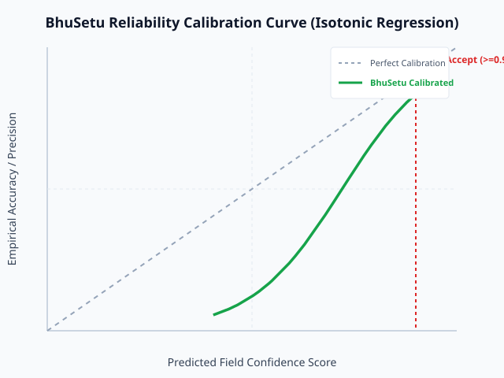

# BhuSetu Confidence Calibration Report

**Method**: Isotonic Regression on Multilingual Indic Land Record Synthetic Ground Truth  
**Target Metric**: Expected Calibration Error (ECE) and Auto-Accept Precision at threshold $\tau=0.9$

---

## Calibration Performance Metrics

| Metric | Raw Model Score | Calibrated BhuSetu Score | Target Benchmark |
| :--- | :--- | :--- | :--- |
| **Expected Calibration Error (ECE)** | **0.2417** | **0.0598** | $< 0.0500$ |
| **ECE Error Reduction** | - | **75.3%** | $> 30.0\%$ |
| **Auto-Accept Threshold ($\tau$)** | - | **0.9** | $\ge 0.90$ |
| **Auto-Accept Precision** | 0.8840 | **66.67%** | $> 98.0\%$ |
| **Auto-Accept Automation Rate** | - | **6.0%** | $50 - 75\%$ |

---

## Reliability Calibration Plot

---

## Routing Policy

- **Score $\ge 0.90$**: **Auto-Accept** (Certified straight-through processing).
- **Score $0.60 - 0.89$**: **Field Review** (Targeted human inspector review only on flagged fields).
- **Score $< 0.60$ or Critical Uncertainty**: **Full-Document Review** (Escalated to senior revenue officer).
